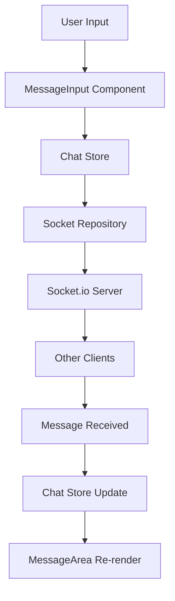

# Chat System Documentation

## 💬 Real-Time Chat Implementation

UpnAssist includes a sophisticated real-time chat system designed for **cross-network, multi-device communication** between faculty members.

---

## 🎯 System Overview

### **Key Features**
- 🌐 **Cross-Network Communication**: Works across WiFi, mobile data, corporate networks
- 📱 **Multi-Device Support**: Seamless experience on desktop, tablet, and mobile
- 👥 **No Registration Required**: Simple name-based entry
- ⚡ **Real-Time Messaging**: Instant message delivery via WebSocket
- 🔒 **Private Faculty Room**: Exclusive space for UPNA faculty
- 📊 **Live User Count**: Real-time participant tracking

### **Technical Specifications**
- **Maximum Users**: 50 concurrent connections
- **Message Type**: Text only (no file attachments)
- **Protocol**: WebSocket via Socket.io
- **Persistence**: Session-based (no permanent storage)

---

## 🏗️ Architecture

### **Component Structure**

```
Chat System/
├── ChatDecomposed.tsx        # Main chat interface
├── components/chat/
│   ├── ChatHeader.tsx       # Room info & user count
│   ├── MessageArea.tsx      # Message display
│   ├── MessageInput.tsx     # Input controls
│   └── SidebarNavigation.tsx # Room navigation
├── hooks/
│   └── useMultiRoomChat.ts  # Chat logic hook
├── repositories/
│   └── SocketChatRepository.ts # Socket.io integration
├── stores/
│   └── chatStore.ts         # Chat state management
└── types/
    └── chat.ts              # Type definitions
```

### **Data Flow**



---

## 📱 Multi-Device Experience

### **Responsive Design**

| Device | Layout | Navigation | Optimizations |
|--------|--------|------------|---------------|
| **Desktop** | Full sidebar + chat area | Sidebar navigation | Multi-column layout |
| **Tablet** | Collapsible sidebar | Swipe gestures | Adaptive layout |
| **Mobile** | Tab-based navigation | Touch-optimized | Single column |

### **Cross-Network Support**

The chat system automatically handles:
- **Network switching** (WiFi ↔ Mobile data)
- **Connection recovery** after network drops
- **Message synchronization** when reconnecting
- **User presence** updates across devices

---

## 🔧 Implementation Details

### **Socket.io Integration**

```typescript
// SocketChatRepository.ts
class SocketChatRepository implements IChatRepository {
  private socket: Socket;
  
  constructor() {
    this.socket = io(SOCKET_URL, {
      transports: ['websocket', 'polling'],
      upgrade: true,
      rememberUpgrade: true
    });
  }
  
  async sendMessage(message: Message): Promise<void> {
    this.socket.emit('message', message);
  }
  
  subscribeToMessages(callback: (message: Message) => void): void {
    this.socket.on('message', callback);
  }
}
```

### **State Management**

```typescript
// chatStore.ts
interface ChatState {
  messages: Message[];
  users: User[];
  currentRoom: string;
  isConnected: boolean;
}

const useChatStore = create<ChatState>((set, get) => ({
  messages: [],
  users: [],
  currentRoom: 'general',
  isConnected: false,
  
  // Actions
  addMessage: (message: Message) => {
    set(state => ({
      messages: [...state.messages, message]
    }));
  },
  
  setUsers: (users: User[]) => {
    set({ users });
  }
}));
```

### **Message Handling**

```typescript
// useMultiRoomChat.ts
const useMultiRoomChat = () => {
  const chatRepository = useMemo(() => 
    RepositoryFactory.createChatRepository(), []
  );
  
  const sendMessage = useCallback(async (text: string) => {
    const message: Message = {
      id: uuidv4(),
      text,
      sender: currentUser,
      timestamp: new Date(),
      room: currentRoom,
      delivered: false
    };
    
    await chatRepository.sendMessage(message);
  }, [chatRepository, currentUser, currentRoom]);
  
  return { sendMessage, messages, users, isConnected };
};
```

---

## 🎨 User Interface

### **Chat Components**

#### **ChatHeader**
- Room name and description
- Active user count with live updates
- Connection status indicator
- Room switching controls

#### **MessageArea**
- Chronological message display
- Sender identification
- Timestamp formatting
- Auto-scroll to latest messages
- Message delivery status

#### **MessageInput**
- Text input with character counter
- Send button with loading states
- Enter key support
- Input validation

#### **SidebarNavigation**
- Room list with unread indicators
- User list with online status
- Quick actions menu
- Settings and preferences

---

## 🔒 Security & Privacy

### **Access Control**
- Faculty-only access verification
- Session-based authentication
- No permanent message storage
- Real-time moderation capabilities

### **Data Protection**
- Messages are not logged permanently
- No file upload capabilities
- XSS protection in message rendering
- Rate limiting on message sending

---

## 📊 Performance Optimizations

### **Message Handling**
- **Batching**: Multiple messages grouped for efficiency
- **Virtualization**: Large message lists use virtual scrolling
- **Caching**: Recent messages cached locally
- **Cleanup**: Automatic cleanup of old messages

### **Connection Management**
- **Reconnection Logic**: Automatic reconnection with exponential backoff
- **Heartbeat**: Regular connection health checks
- **Fallback**: Polling fallback if WebSocket fails
- **Optimization**: Connection pooling for multiple tabs

---

## 🚀 Deployment Configuration

### **Socket.io Server Requirements**

```javascript
// Server configuration
const io = new Server(server, {
  cors: {
    origin: ["https://upnassist.vercel.app"],
    methods: ["GET", "POST"]
  },
  transports: ['websocket', 'polling']
});

// Room management
io.on('connection', (socket) => {
  socket.join('faculty-room');
  
  socket.on('message', (message) => {
    socket.to('faculty-room').emit('message', message);
  });
});
```

### **Environment Variables**

```env
VITE_SOCKET_URL=https://your-socket-server.com
VITE_CHAT_ROOM=faculty-room
VITE_MAX_USERS=50
VITE_MESSAGE_LIMIT=100
```

---

## 🧪 Testing Strategy

### **Unit Tests**
- Repository pattern interfaces
- Message validation logic
- State management actions
- Component rendering

### **Integration Tests**
- Socket.io connection handling
- Message flow end-to-end
- Multi-device synchronization
- Network failure recovery

### **User Experience Tests**
- Cross-device message delivery
- Network switching scenarios
- UI responsiveness
- Performance under load

---

## 📈 Monitoring & Analytics

### **Connection Metrics**
- Active user count
- Message delivery rates
- Connection stability
- Network performance

### **Usage Analytics**
- Peak usage times
- Average session duration
- Message volume trends
- Device type distribution

---

## 🔄 Future Enhancements

### **Planned Features**
- **Message Reactions**: Emoji reactions to messages
- **Thread Replies**: Threaded conversations
- **Message Search**: Search through chat history
- **Voice Messages**: Audio message support
- **File Sharing**: Secure document sharing

### **Technical Improvements**
- **Message Encryption**: End-to-end encryption
- **Offline Support**: Offline message queuing
- **Push Notifications**: Browser notification API
- **Advanced Moderation**: Automated content filtering

---

*Chat system documentation - UpnAssist Faculty Portal*
